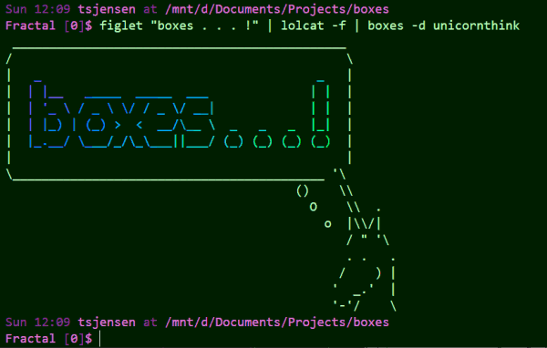

[](https://github.com/ascii-boxes/boxes/actions/workflows/boxes.yml)

# boxes

**Command line ASCII boxes unlimited!**

[Boxes](https://boxes.thomasjensen.com/) is a command line filter program which draws ASCII
art boxes around your input text ([examples](https://boxes.thomasjensen.com/examples.html)).



For more information, please visit [the website](https://boxes.thomasjensen.com/).

## Download

The recommended way is to install *boxes* via your package manager. But many ways exist
to get *boxes* onto your machine, [details here](https://boxes.thomasjensen.com/download.html).

## Running it

Try if boxes works by typing `echo foo | boxes` on the command line.
It should give you something like that:

    /*******/
    /* foo */
    /*******/

Type `boxes -l` to get a long list of box designs to use. Detailed usage information is in the
[manual page](https://boxes.thomasjensen.com/boxes-man-1.html) and on the website. Consider
[tying *boxes* to your editor](https://boxes.thomasjensen.com/editors.html),
so that it can be invoked by a simple keypress.

## Status

*Boxes* is **stable**.

It has been around since 1999, and is still available and kept current in many package managers
(apt, rpm, choco, brew, just to name a few). Its source code is quite portable, and so, *boxes*
has been made to run on a wide range of platforms, from Windows PCs to Netgear routers.

*Boxes* has matured, and is thusly no longer being actively developed. But contributors can be sure
that their pull requests are promptly reviewed and merged into the main code base.

Update 2021: In 2021, the original author has turned to *boxes* again in order to implement all
open issues, including full multi-byte character set support. This is still ongoing, but there
have already been two new releases with significant new functionality.

## Development

The website has information on [building from source](https://boxes.thomasjensen.com/build.html),
[testing](https://boxes.thomasjensen.com/testing.html), and
[contributing](https://boxes.thomasjensen.com/contributing.html) to the source code.<br/>
*Boxes* has received support from many [contributors](https://boxes.thomasjensen.com/team.html#contributors)
over the years, and continues to benefit greatly from contributions. Many thanks for that!

## Custom box designs

You can define [your own box designs](https://boxes.thomasjensen.com/config-general.html)!

We appreciate the creative new box designs that you craft for *boxes*.
If you think that others should have your box designs, please feel free to submit them in the
form of pull requests on
[boxes-config](https://github.com/ascii-boxes/boxes/blob/master/boxes-config),
and they may make it into the next release!

## License

Boxes is free software under the GNU General Public License, version 2
([GPLv2](http://www.gnu.org/licenses/old-licenses/gpl-2.0.html)).

```
 _________________________
/\                        \
\_|    Thank you for      |
  |    using Boxes!       |
  |  _____________________|_
  \_/______________________/
```
